# 국립공원 위성 인사이트 — 태안해안국립공원 (해상·해안)

**발행**: 2026-06-17 13시 · **분야**: 해상·해안 · **센서**: Sentinel-2 L2A (ESA) · 10 m
**원본 촬영**: 2026.06.15 11:27 KST (구름 2.4%, 신규 위성영상) · **분석 범위**: 공원 경계(폴리곤) 내부

> ⚠️ **추정치 안내**: 본 콘텐츠의 모든 수치·판정·해석은 AI·알고리즘이 위성영상을 자동 분석한 **추정 결과**로, 사실과 다를 수 있습니다. 공식 통계·현장 확인과 차이가 있을 수 있으므로 참고용으로만 활용하시기 바랍니다.

---

## 핵심 발견
> **태안해안국립공원 해상·해안 경관 현황 — 수역 약 67.9% · 식생 약 18.3%**

## 1단계 — 발견 (최신 1장, 공원 경계 내부)
- 2026.06.15 11:27 KST 촬영 영상이 태안해안국립공원에 걸쳐, 공원 경계 안에서 해상·해안(공원 내 수역 비율(%))을(를) 분석했습니다.
- 공원 내 수역 비율(%): 약 67.9.
- 공원 내 수역(바다·내만) 약 67.9%
- 식생 약 18.3% · 갯벌·모래·암 약 10.1%
- 해안선·섬·내만 경관 현황

## 2단계 — 시계열 검증 (같은 계절·연도별)
같은 공원의 과거 같은 계절 청천 영상(7개)과 비교해 검증합니다.
- 과거: 05-23 44.48, 04-27 43.75, 05-22 47.8, 06-01 43.69, 06-16 45.4, 06-10 44.44, 07-10 44.63
- 현재: 06-15 약 67.9
- **판정: 수역이 과거 대비 넓은 편(과거 평균 약 44.884)**
- ※ 자동 분석 결과로 정밀 판독·현장 확인이 필요합니다.

## 분석 종합 (발견 + 검증)
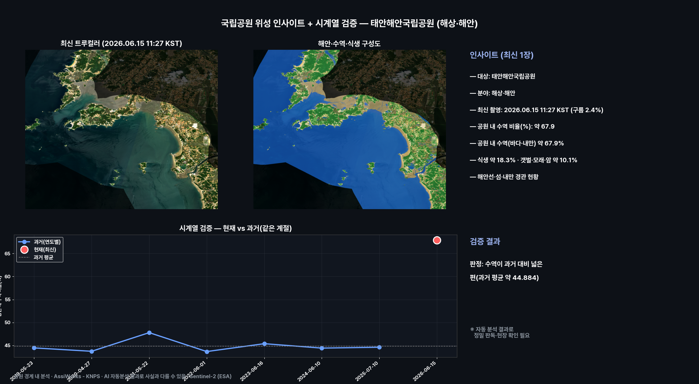

## 해안·수역·식생 구성도
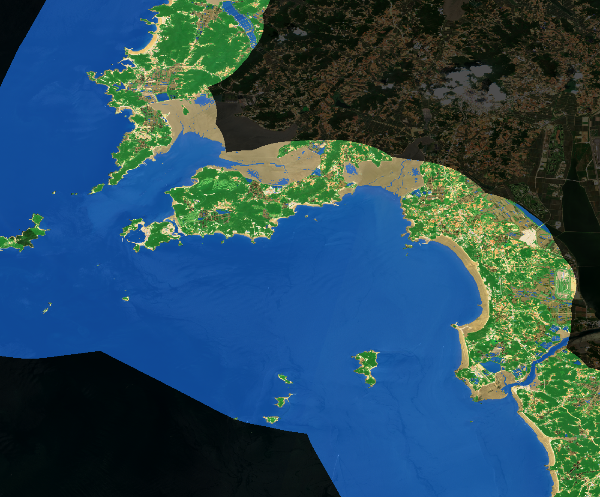

## 연도별 과거 영상 (같은 계절 · 공원 경계)
같은 공원을 해마다 같은 계절에 촬영한 트루컬러 위성영상입니다(각 이미지에 촬영 시각 표기). 리포트에서 바로 과거와 현재를 비교해 보세요.

**2020.06.21 11:27 KST**

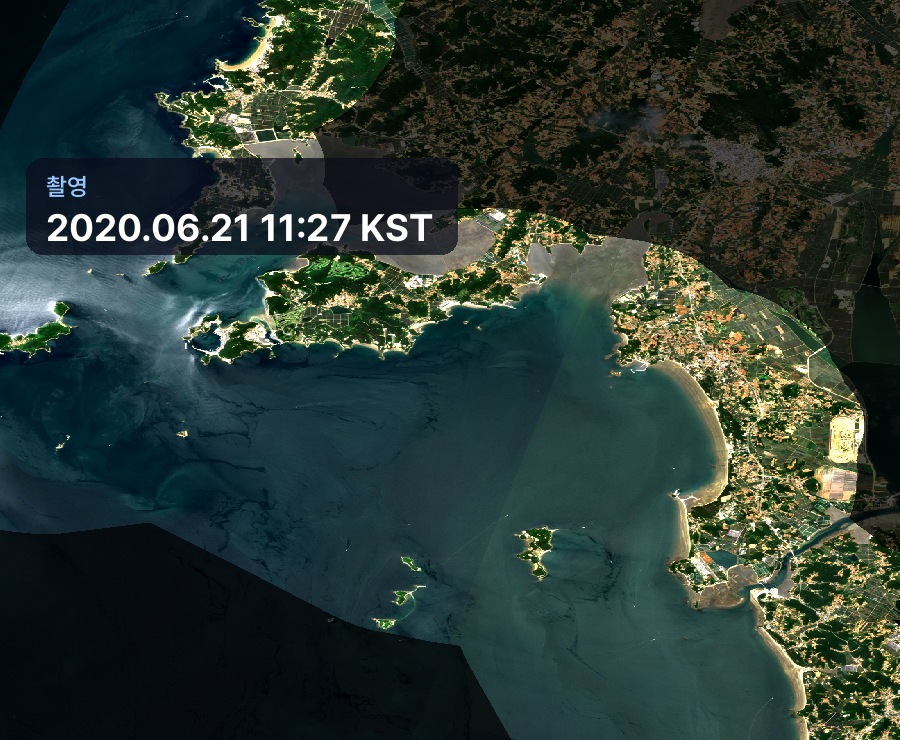

**2021.05.22 11:27 KST**

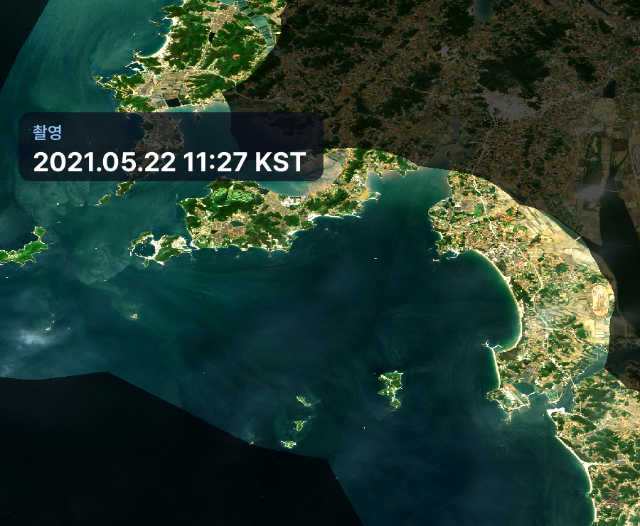

**2022.06.01 11:27 KST**

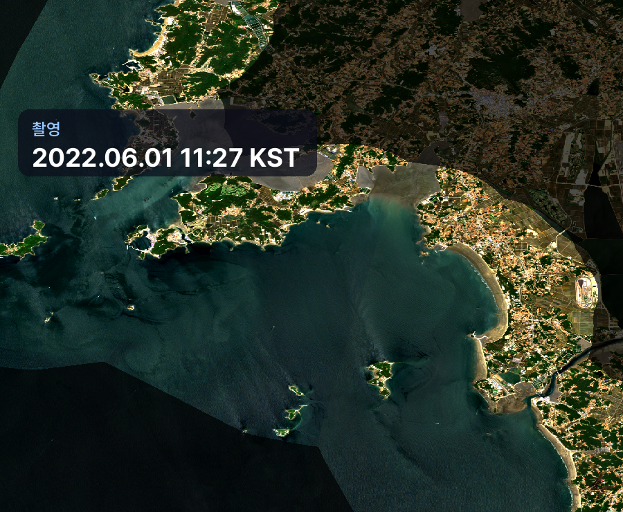

**2023.06.16 11:27 KST**

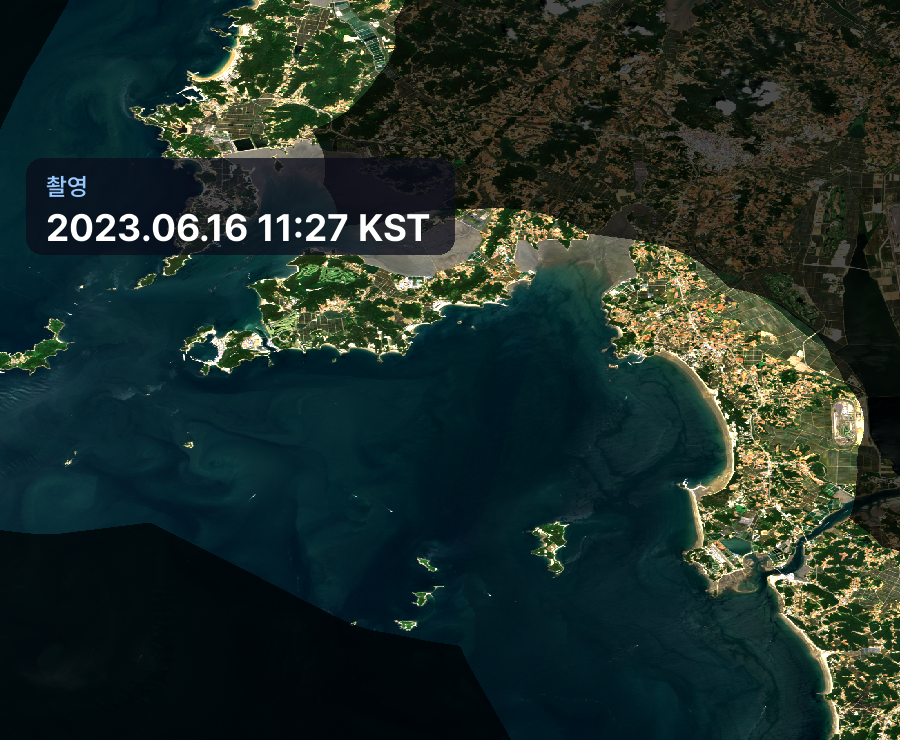

**2024.06.10 11:27 KST**

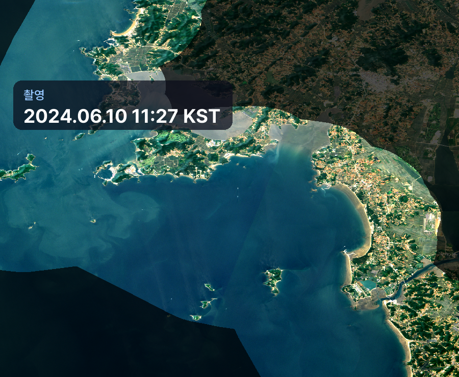

**2025.07.10 11:27 KST**

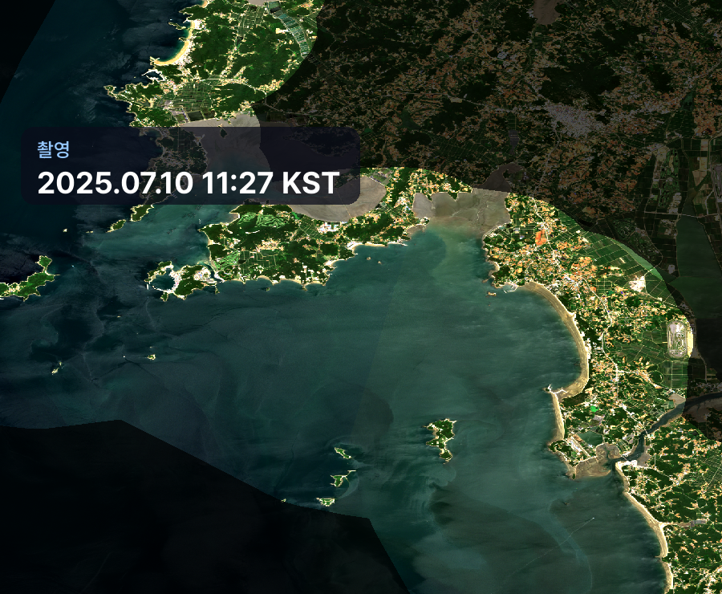

**2026.06.15 11:27 KST**

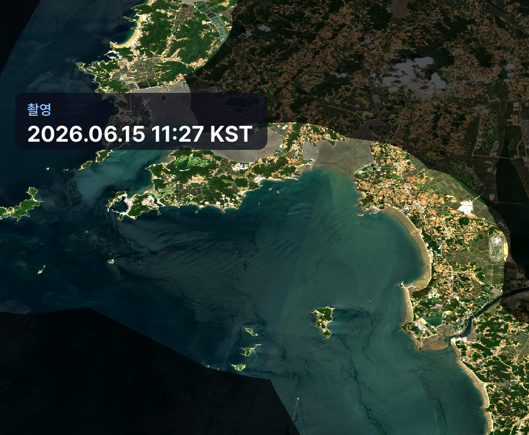

## 영상카드 (미리보기)

_아래는 각 영상의 대표 장면입니다. 영상은 링크에서 재생/다운로드._

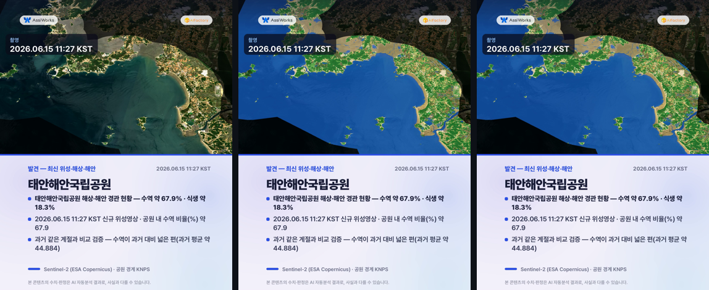
▶️ [card1_discovery.mp4 영상 보기](videocards/card1_discovery.mp4)

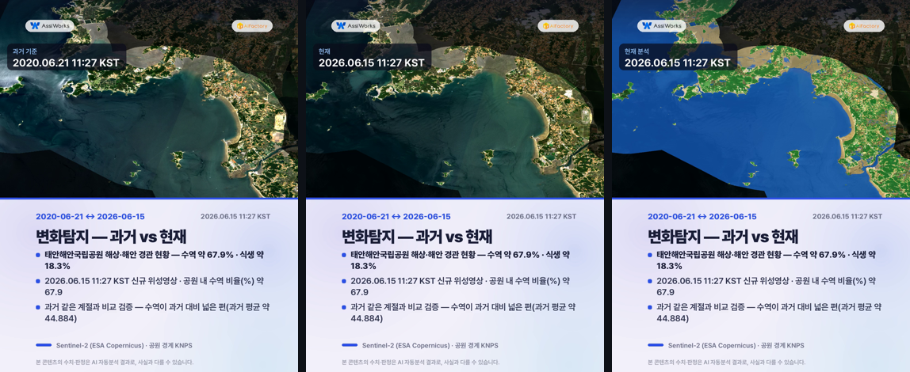
▶️ [card_change.mp4 영상 보기](videocards/card_change.mp4)

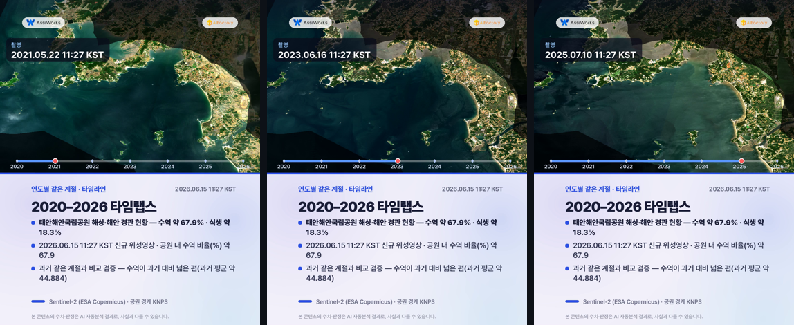
▶️ [card_timelapse.mp4 영상 보기](videocards/card_timelapse.mp4)

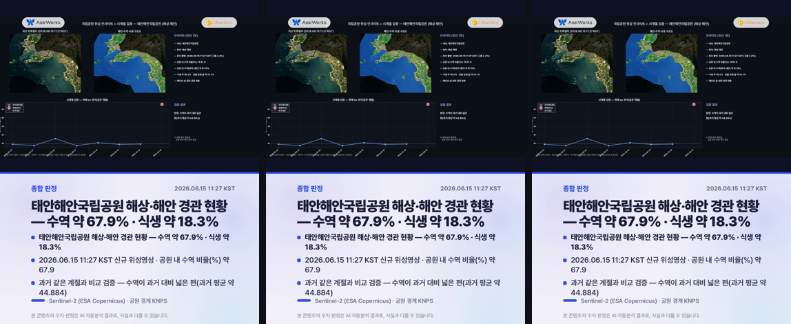
▶️ [card4_summary.mp4 영상 보기](videocards/card4_summary.mp4)

---
_AssiWorks - KNPS · 2026-06-17 13시 · Sentinel-2 (ESA)_
